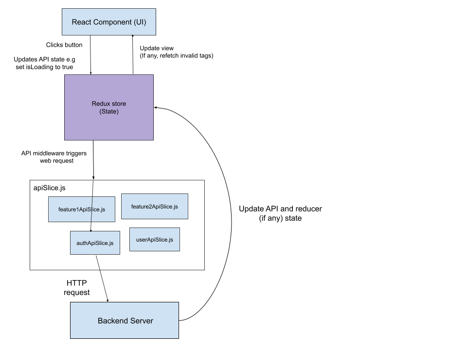

# 📦 Moornmo Full-Stack Assignment Submission

**Candidate Name**:  Phantakorn Prarusudamkerng \
**Email Address**:  jj.phantakorn@outlook.com \
**GitHub Repository (if any)**:  \
**Submission Date**:  Wednesday 30th July 2025

---

## ✅ 1. Project Overview

I am using MERN stack for this project. The specifics details are:

- Backend framework used:  Express (NodeJS)
- Frontend framework used:  ReactJS
- State management library:  RTK Query (Redux-Toolkit)
- Authentication method:  JWT
- Deployment method (if any):  
- Database: MongoDB (mongoose library)

Different smart factory software for different clients may have different requirements therefore structure cannot be guaranteed hence the choice of noSQL database. This will also help with consistent workflow since we do not have to swap between different tech stack.

---

## 🧠 2. Architecture Explanation

### Folder Structure
Describe your folder/component structure and reasoning.

I have separated my front and backend to each having their own `package.json` file. This is to separate front/backend dependencies and also means you can run each one individually making them much more robust and scalable.

Here is the root folder structure:
```
.
├── README.md
├── backend
└── frontend
```
### Backend folder structure:
```
backend
├── controllers
│   ├── authController.js
│   └── userController.js
├── db
│   └── database.js
├── middleware
│   ├── loginLimiter.js
│   └── verifyJWT.js
├── models
│   └── userModel.js
├── package-lock.json
├── package.json
├── routes
│   ├── authRoute.js
│   └── userRoute.js
└── utils
│    └── validateEmail.js
└── server.js
```
- `server.js` is the single entrypoint of the backend. Triggers connection to the database (MongoDB) and configure any routes and middleware.

- When an API endpoint is called, the routing goes from:
`server.js` -> `routes/` -> `controllers/`
 Example with auth routing:
`server.js` -> `routes/authRoute.js` -> `controllers/authController.js`

- `/models/` holds typed MongoDB schema and is instantiated and called to perform CRUD operations. It is used in the `controllers/`

##### Adding new feature

When extending new feature, simply define new files like so:
```
backend
├── models
│ └── <feature>Model.js # Mongoose schema for <feature>
├── controllers
│ └── <feature>Controller.js # Business logic for <feature>
├── routes
│ └── <feature>Route.js # HTTP endpoints for <feature>
```

### Frontend folder structure:
```
frontend
├── public
├── src
│   ├── App.jsx
│   ├── App.css
│   ├── reportWebVitals.js
│   ├── i18n.js
│   ├── index.css
│   ├── index.jsx
│   ├── logo.svg
│   ├── app
│   │   ├── apiSlice.js
│   │   └── store.js
│   ├── component
│   │   ├── ...
│   │   └── ...
│   ├── features
│   │   ├── auth
│   │   │   └── ...
│   │   └── user
│   │       └── ...
│   ├── hooks
│   │   └── ...
│   ├── locales
│   │   ├── en
│   │   │   └── ...
│   │   └── th
│   │       └── ...
│   └── pages
│       └── ...
├── tsconfig.json
├── vite.config.ts
├── eslint.config.js
├── index.html
├── package-lock.json
└── package.json
```
- `App.jsx` is your main React entrypoint

- `public/` contains purely static files.

- `src/app/` stores global state (`store.js`) & main API slice (Redux Toolkit) which we will inject our feature endpoints into later.

- `src/component/` stores reusable UI component or anything that is not a page itself.

- `src/features/` groups feature-specific logic and api slices. 

- `src/hooks/` stores custom hooks.

- `src/pages/` stores route-level views, each in its own folder with helper files.

- `src/locales/` is structured by language (en, th) and namespace JSONs for i18n. (defined in `src/i18n.js`)

##### Adding new feature

When adding new API endpoints:
```
frontend
├── src
│   └── features
│   │   └──<feature>
│   │   │  ├── <feature>ApiSlice.js
│   │   │  └── <feature>Slice.js (if applicable)
```

You may also want to add your `<feature>Slice` reducer to your `store.js` if needed.

Any components or pages can be created to their respective folders.


### State Management

Why did you choose this state management library? 

I chose Redux-Toolkit because I am most familiar with it and it is the only state management libraries I have used before. I also think it makes your code clean.
 
Provide a simple flow or diagram if possible.



---

## 🔐 3. Backend Details

- Endpoints implemented:
  - [x] POST /login
  - [x] GET /users
  - [x] POST /users
  - [x] PUT /users/:id
  - [x] DELETE /users/:id

- JWT applied: (Yes)  
- Swagger or API Docs: (Yes) [Postman here](https://www.postman.com/spaceflight-pilot-29673053/nvfact-fullstacktest/collection/39jnvq3/phantakorn-nvfact-fullstacktest?action=share&creator=21408966)


#### Setting up backend
Create `.env` in your backend folder
Define the following key:

- `FRONTEND_URL`: Your frontend URL (use http://localhost:3000 as default)

- `MONGODB_API_KEY`: Your MongoDB key (Email me if you want the key for a sample database)
Note: Your MongoDB API key will look something like `mongodb+srv://<username>:<password>@cluster0.dtrrl.mongodb.net/?retryWrites=true&w=majority&appName=Cluster0`
- `ACCESS_TOKEN_SECRET`: Generate by running on `node` the command `require('crypto').randomBytes(64).toString('hex')`
- `REFRESH_TOKEN_SECRET` : Generate same way as `ACCESS_TOKEN_SECRET`
#### Instructions to run backend:
```bash
# e.g.
cd backend
npm install
npm run dev
```

---

## 💻 4. Frontend Details

- Components implemented:
  - [x] Login page
  - [x] User table with filter
  - [x] User create/edit form
  - [x] Dashboard (Three.js or visual summary)

#### Setting up frontend
Create `.env` in your frontend folder
Define the following key:

- `VITE_APP_BACKEND_URL`: Your backend URL (use http://localhost:3001 as default)

#### Instructions to run frontend:
```bash
# e.g.
cd frontend
npm install
npm run dev
```

---

## 🧮 5. SQL Answers

### Q1: Daily login count (past 7 days)

Assuming we do not count login from the same user more than once
```sql
SELECT 
  DATE(login_time), 
  COUNT(DISTINCT(user_id)) as unique_users_logged_in
FROM user_logins
WHERE DATEDIFF(CURRENT_DATE, DATE(login_time)) < 7
GROUP BY DATE(login_time);
```

### Q2: Detect 3 consecutive login days
```sql
WITH dates AS (
  SELECT user_id, DATE(login_time) AS d
  FROM user_logins
  GROUP BY user_id, DATE(login_time)
)
SELECT DISTINCT d1.user_id as three_day_consecutive_login_user
FROM dates d1
JOIN dates d2 
  ON d2.user_id = d1.user_id 
  AND DATEDIFF(d2.d, d1.d) = 1
JOIN dates d3 
  ON d3.user_id = d1.user_id 
  AND DATEDIFF(d3.d,d1.d) = 2;
```

---

## 📄 6. Additional Notes or Assumptions

(Describe any assumptions made, mock data used, or areas you'd improve.)
Hashed password field included in the database (In the file `Moornmo_Fullstack_Assignment_EN.md` password was not included in the fields requirement)

Assumption:
- Test marker will create their own MongoDB database (Email me if needed)
- Status (ACTIVE/INACTIVE) is the ability for admin to disable user if needed. (Not user online/offline)

Areas to improve:
- Separate backend and frontend to its own git projects (for the sake of the assignment I stored it as 1 to keep things simple)
- Add users table paging
- On user first create, must verify email before admin can update status (ACTIVE/INACTIVE)
- Improve layout (Responsive for mobile)
- Add field to assign user to a specific station (within the smart factory). That way in dashboard you could see how many people are working on each station and allocate them as such.

---

## 📸 7. Screenshots (Optional)

(Include key screenshots of your UI, dashboard, or Swagger documentation.)

---

## 📂 8. Docker / i18n / Bonus Items

- Dockerized: (Yes/No)  
- i18n support (EN/TH): (Yes)  
- Postman collection included: (Yes)  

---

Thank you for reviewing my submission!
